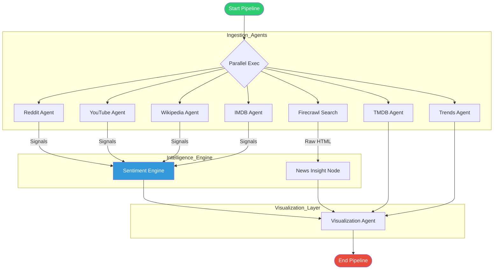

# CineMatrix 🎬

CineMatrix is an advanced **Agentic Movie Intelligence Platform** that aggregates, analyzes, and visualizes data from diverse sources (Social Media, Wikis, Metadata APIs, and Search Trends) to provide a 360-degree view of any movie.

## 🚀 Key Features

- **Multi-Agent Ingestion**: Parallel agents fetch data from **Reddit**, **YouTube**, **Wikipedia** (Native Search), **IMDB**, **TMDB**, **Google Trends**, and **News** (via Firecrawl).
- **Advanced Sentiment Analysis**: Custom **Sentiment Engine** combining **RoBERTa** (local model) and **LLM Refinement** to score reviews/comments and extract aspects (Acting, Plot, Music).
- **Intelligent Deduplication**: Prevents redundant data ingestion using semantic similarity checks.
- **Dynamic Visualization**: Interactive dashboards powered by React & Recharts.
- **Resilient Fallbacks**: e.g., Switches to SerpApi if YouTube Quota exceeds; uses intelligent discovery for ambiguity (e.g., finding "Gladiator (2000 film)" vs the fighter).

## 🏗️ Architecture

The system uses a **LangGraph** orchestrator to manage parallel agent execution.



## 🛠️ Setup

1.  **Prerequisites**:
    *   Python 3.10+
    *   Node.js 16+
    *   MongoDB (running locally on port 27017)

2.  **Environment Variables**:
    Copy `.env.example` to `.env` and fill in your keys:
    ```bash
    cp .env.example .env
    ```

3.  **Installation**:
    ```bash
    # Backend
    python3 -m venv venv
    source venv/bin/activate
    pip install -r requirements.txt
    
    # Frontend
    cd frontend
    npm install
    ```

4.  **Running the App**:
    Use the convenience script to start both Backend (Port 8000) and Frontend (Port 5173):
    ```bash
    chmod +x start_app.sh
    ./start_app.sh
    ```

## 🧠 Usage

To ingest a new movie, use the `ingest_movie.py` script:

```bash
# Syntax: python scripts/ingest_movie.py "<Movie Title>" <IMDB_ID>
python scripts/ingest_movie.py "Inception" tt1375666
```

This triggers the **Agent Orchestrator**, runs all nodes, performs sentiment analysis, and updates the dashboard in real-time.

## 📁 Project Structure

*   `agents/`: LangGraph nodes (Reddit, YouTube, Wiki, etc.) and Orchestrator.
*   `backend/`: FastAPI server, Database models, and Data Client wrappers.
*   `ml/`: Machine Learning pipelines (Sentiment/Aspect models).
*   `frontend/`: React + Vite dashboard application.
*   `scripts/`: Utility scripts for ingestion, backfilling, and maintenance.

---
Built with ❤️ by the CineMatrix Team.
